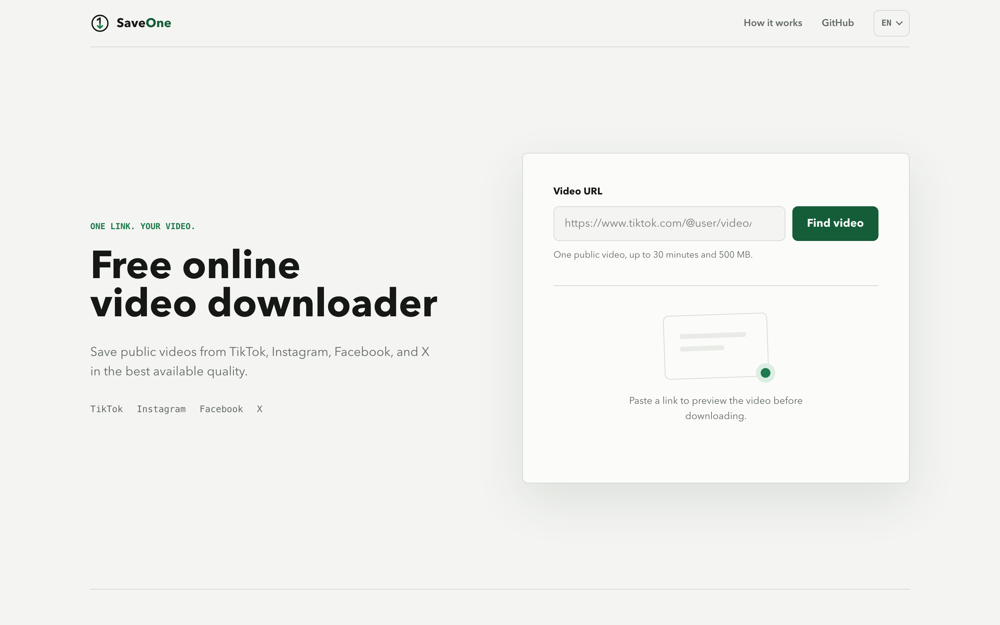

# SaveOne

[English](README.md) | [简体中文](README.zh-CN.md)

**One link. One public video.**

SaveOne is a lightweight online video downloader for saving one public video at a time from YouTube, TikTok, Instagram, Facebook, X, or Reddit. Paste a link, preview the video, and download the best file currently available from the source platform.

[Try SaveOne](https://saveone.pro/) · [Report a problem or suggest an improvement](https://github.com/mashukui/SaveOne/issues)

## What SaveOne offers

- Supports public videos from YouTube, TikTok, Instagram, Facebook, X, and Reddit
- Shows the title, source, duration, and estimated size before downloading
- Selects the best available quality and combines video and audio when possible
- Adds no watermark of its own; the source video may already contain one
- Requires no SaveOne account and does not support batch downloads
- Available in English, Spanish, Portuguese, French, German, Japanese, Korean, and Simplified Chinese
- Works in modern desktop and mobile browsers

## How to use it

1. Open [saveone.pro](https://saveone.pro/).
2. Paste one supported public video URL and select **Find video**.
3. Review the preview, start the download, and save the temporary file when it is ready.

## Current limits

- One public video per request
- Up to 30 minutes and 500 MB per video
- No playlists, profiles, private media, login-only media, or bulk downloads
- Temporary files are removed automatically after approximately 30 minutes
- Availability and quality depend on what the source platform provides at that time

Supported platforms may change their websites, access rules, or media formats without notice. A link that works today may temporarily stop working later. Some Instagram videos may be supplied without an audio track; when SaveOne can detect this in advance, it asks for confirmation before downloading the silent file.

## Feedback and bug reports

This repository is the public feedback channel for SaveOne. Please use [GitHub Issues](https://github.com/mashukui/SaveOne/issues) to report:

- A public video link that cannot be read or downloaded
- A file with missing audio, incorrect quality, or an unexpected format
- A browser or layout problem
- A translation issue
- A focused product improvement

For a useful report, include the source platform, public video URL, expected result, actual result, browser, device, country or region, and the exact error message when available.

Do not post account credentials, cookies, access tokens, private links, personal information, or downloaded media files. Submit copyright or takedown requests through [GitHub Issues](https://github.com/mashukui/SaveOne/issues).

## Source code

This repository is a product information and feedback repository. It is **not an open-source distribution**, and the SaveOne application source code, server configuration, and deployment files are not published here.

No open-source license is granted for the SaveOne application. Unless explicitly stated otherwise, the SaveOne name, branding, documentation, and screenshots are all rights reserved.

## Responsible use

Use SaveOne only for public media that you created, have permission to use, or may lawfully download. You are responsible for following the source platform's terms and applicable copyright laws.

SaveOne is an independent service and is not affiliated with, endorsed by, or sponsored by YouTube, TikTok, Instagram, Facebook, X, Reddit, or their parent companies.

## Links

- Website: [https://saveone.pro/](https://saveone.pro/)
- About: [https://saveone.pro/about](https://saveone.pro/about)
- Terms: [https://saveone.pro/terms](https://saveone.pro/terms)
- Privacy: [https://saveone.pro/privacy](https://saveone.pro/privacy)
- Feedback: [GitHub Issues](https://github.com/mashukui/SaveOne/issues)
